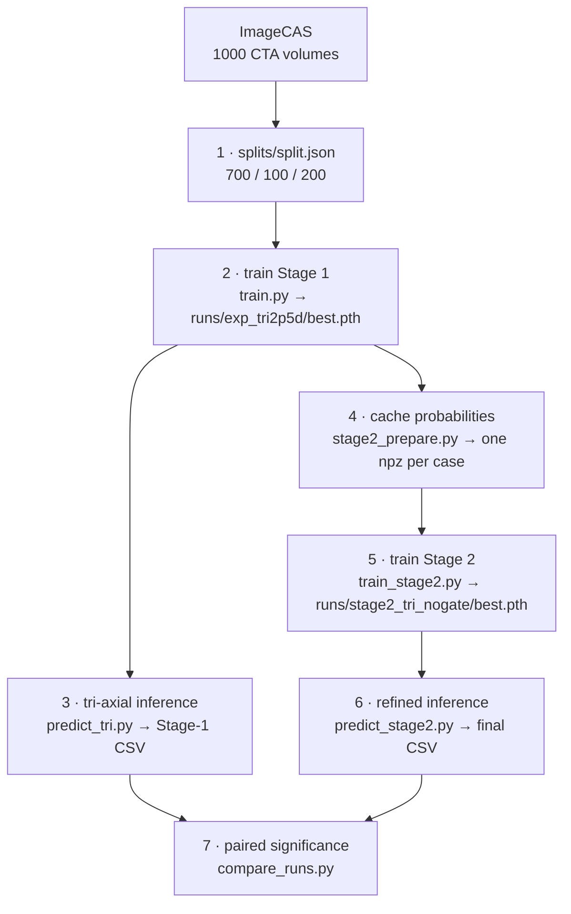

# Coronary Artery Segmentation from CTA

*[中文说明 / Chinese version](README.zh.md)*

A two-stage pipeline that segments the coronary artery tree from cardiac CTA volumes,
trained and evaluated on the [ImageCAS](https://arxiv.org/abs/2211.01607) dataset
(1000 cases, 700 / 100 / 200 split).

The coronary lumen occupies **less than 1 %** of a CTA volume and forms a thin, branching
tree. Dice barely moves when a distal branch is lost, but the clinical value of a
segmentation rests on exactly that connectivity. This project therefore optimises and
reports **topology alongside overlap**.

---

## Results

All figures are means over the **full 200-case test set**, after identical
post-processing (`--min-voxels 300 --max-gap 0`).

| Configuration | Dice | clDice | Betti-0 error | HD95 (mm) |
|---|---|---|---|---|
| Single-axis 2.5D | 0.7955 | 0.8581 | 4.19 | 24.98 |
| Single-axis 2.5D + TTA | 0.8027 | 0.8670 | 3.68 | 23.66 |
| Tri-axial fusion (Stage 1) | 0.8098 | 0.8762 | 2.46 | 20.53 |
| **+ topology-aware refinement (final)** | **0.8216** | **0.8960** | **1.53** | **19.90** |

Both stages improve **all four metrics**. Every comparison is paired per case and tested
with a Wilcoxon signed-rank test with Holm–Bonferroni correction across the four metrics:

- **Tri-axial fusion vs. single-axis + TTA** — significant on all four
  (Dice *p* = 4.2 × 10⁻⁸, Betti-0 *p* = 1.5 × 10⁻¹²).
- **Final vs. Stage 1** — significant on all four
  (clDice *p* = 5.1 × 10⁻²³ with 165 of 200 cases improved; HD95 *p* = 0.037).

The largest relative gain is on **Betti-0 error, which falls by 63 %** against the
single-axis baseline (4.19 → 1.53) — that is, the output is much closer to the two
connected trees the anatomy actually has.

Per-case metric CSVs for every configuration above are committed under `runs/`, so the
statistics can be recomputed without a GPU (step 7 of the pipeline below).

---

## Method

**Stage 1 — 2.5D tri-axial segmentation.** A single 2D network with shared weights
processes slices along all three orthogonal axes. Each input stacks `2k+1 = 5` adjacent
slices as channels and the network predicts the centre slice. At inference the three
directional probability volumes are fused by a voxel-wise mean. This buys wide
in-plane context under a memory budget that a full 3D network cannot match: a 3D model
on an 80 GB card handles patches of about 128³ voxels, while a coronary tree spans
over 200 mm.

**Stage 2 — topology-aware residual refinement.** A 3D network takes the image and the
Stage-1 probability and predicts a **residual correction** to the Stage-1 logit, with a
zero-initialised head so training starts from the identity. Its loss adds
**soft-clDice** — a differentiable centreline-overlap term — to a DiceFocal region term.
The module is independent of the architecture it follows: it improves two different
Stage-1 outputs.

```
Preprocessing   RAS orientation → 0.5 mm isotropic → HU window [-200, 800] → [0, 1]
Stage 1         tri-axial 2.5D slices → 2D SegResNet → DiceCE → bfloat16 AMP
Fusion          voxel-wise mean over three axes → threshold 0.50
Stage 2         [image, p_stage1] → 3D SegResNet → residual → DiceFocal + 0.5·soft-clDice
Post-process    remove connected components below 300 voxels
Evaluation      Dice · clDice · Betti-0 error · HD95, per case, paired tests
```

---

## Repository layout

`scripts/` and `slurm/` use the **same five groups**, so a result, the script that produced
it, and the job that ran it sit at matching paths.

```
coronary-seg/
├── src/                       # reusable modules
│   ├── data.py                #   tri-axial 2.5D pipeline, slice indexing, balanced sampling
│   ├── model.py               #   Stage-1 network (2D SegResNet / UNet)
│   ├── engine.py              #   train/val loop, bfloat16 AMP, non-finite gradient guard
│   ├── ckpt_init.py           #   --resume vs --init-from (deliberately separate)
│   ├── stage2_{data,model,loss}.py
│   ├── spatial_prior.py       #   explored, not adopted
│   └── smart_reconnect.py     #   evaluated and rejected, disabled by default
├── scripts/                   # entry points, grouped by pipeline stage
│   ├── data/  train/  predict/  analysis/  figs/
├── slurm/                     # optional batch-job wrappers, same grouping
├── runs/                      # per-case metric CSVs, one directory per configuration
├── splits/split.json          # frozen 700/100/200 split, seed 42
├── tests/                     # run directly: python tests/xxx.py
└── configs/default.yaml
```

Model weights are not in the repository. **The per-case CSVs they produced are** — every
comparison quoted above is recomputed from those files by
`scripts/analysis/compare_runs.py`.

---

## Reproduction

The pipeline is seven steps. Steps 2–6 need a CUDA GPU; step 7 reads CSVs only and needs
neither GPU nor PyTorch.



### What you need

| | |
|---|---|
| GPU | One CUDA card. The reported models used 80 GB; the batch sizes below are sized for that — scale `--batch-size` down on smaller cards. |
| Disk | Several hundred GB. Raw ImageCAS is ~50 GB; the preprocessing cache and the Stage-2 tensors are each larger (Stage 2 writes 40–80 MB per case, so 40–80 GB for 1000 cases). |
| Time | Days, not hours. Stage 1 is 70 epochs over ~1000 cases; tri-axial inference and Stage-2 data preparation each run the network three times per volume. |

Every long-running script is **resumable**: training restores from `last.pth` with
`--resume`, the prediction scripts skip cases already present in the output CSV, and
`stage2_prepare.py` skips `.npz` files that already exist.

### 0 · Environment

Python 3.10+ with a CUDA build of PyTorch. Install PyTorch first, matched to your CUDA
version, then the rest:

```bash
cd coronary-seg
python -m venv .venv && source .venv/bin/activate      # or conda create / activate
pip install torch --index-url https://download.pytorch.org/whl/cu124
pip install -r requirements.txt
```

Set three variables once — they are referenced throughout:

```bash
export PYTHONPATH=.                     # required: the scripts import `src.*`
export CACHE=/path/to/cache/preproc  # preprocessed volumes (written on first use)
export S2DATA=/path/to/cache/stage2  # Stage-2 tensors
```

Optional smoke test — overfits a single batch on CPU in a couple of minutes and shows the
loss collapsing. Worth running before committing to a multi-day training job:

```bash
CUDA_VISIBLE_DEVICES="" python scripts/train/train.py --cache-dir "$CACHE" \
    --overfit-one-batch --crop-size 128 --max-cases 5 --steps 150 --num-workers 0
```

### 1 · Data and splits

ImageCAS is **not redistributed here**. Download it from Kaggle
(`xiaoweixumedicalai/imagecas`, ~50 GB) under the dataset's own licence terms.

The frozen 700/100/200 split behind every number in this README is committed at
`splits/split.json`. It stores absolute paths, so repoint them at your copy of the data:

```bash
python - <<'PY'
import json, pathlib
ROOT = "/path/to/ImageCAS"          # the directory holding 1-200/, 201-400/, ...
p = pathlib.Path("splits/split.json")
d = json.loads(p.read_text())
for records in d.values():
    if not isinstance(records, list):
        continue
    for r in records:
        for key in ("image", "label"):
            r[key] = f"{ROOT}/{'/'.join(r[key].split('/')[-2:])}"
p.write_text(json.dumps(d, indent=2))
PY

python scripts/data/check_data.py --data-root /path/to/ImageCAS   # optional integrity check
```

`check_data.py` verifies that all 1000 cases are present and that every case named in
`split.json` exists on disk, then prints the shape, spacing and foreground fraction of a
sample volume. Run it before the first training job — it is the cheapest way to catch a
wrong `ROOT`.

Reusing the committed split is what keeps the numbers comparable; generating a new one
gives you a different test set and different absolute values.

> `check_data.py --regenerate` can build a split from scratch with the same seed and
> ratios, but it writes the image path under the key `img`, whereas the training pipeline
> reads `image`. Patch the committed file as above rather than regenerating it.

### 2 · Train Stage 1

Tri-axial sampling is the default — there is no flag to turn it off. The first run builds
the preprocessing cache and the slice index (slow); later runs reuse both.

```bash
python scripts/train/train.py \
    --split-json splits/split.json --cache-dir "$CACHE" \
    --k 2 --crop-size 384 --batch-size 32 --epochs 70 --lr 3e-4 \
    --grad-clip 1.0 --backbone segresnet \
    --num-workers 8 --pin-memory \
    --out-dir runs/exp_tri2p5d
```

Produces `runs/exp_tri2p5d/best.pth` (best validation Dice) and `last.pth` (resume point).
**The reported model is epoch 59, val Dice 0.8135** — both are stored in the checkpoint, so
you can always check what you loaded.

> `--batch-size 32 --crop-size 384` are the values that produced the reported model. The
> argparse defaults in `train.py` are *not* those values; prefer the flags above.
>
> `--resume` is only for a run that was interrupted. To train further from a run that
> already finished its `--epochs`, use `--init-from <ckpt> --out-dir <new dir>` instead:
> `--resume` would restore the exhausted cosine schedule and drive the learning rate back
> towards its peak. `tests/test_init_from.py` covers this.

### 3 · Stage-1 inference and evaluation

Predicts along all three axes, fuses by mean, thresholds, removes small components, and
writes per-case metrics.

```bash
python scripts/predict/predict_tri.py \
    --cache-dir "$CACHE" --ckpt runs/exp_tri2p5d/best.pth \
    --fixed-fuse mean --thr 0.50 \
    --min-voxels 300 --max-gap 0 \
    --max-cases 0 --batch 1 --max-px-per-batch 500000 --pad-multiple 32 \
    --out-csv runs/exp_tri2p5d/test_metrics_tri_mean050_v2.csv
```

Each row holds both the raw (`raw_*`) and post-processed (`pp_*`) metrics for one case.
`--batch 1 --max-px-per-batch 500000` keeps sagittal and coronal slices, which are larger
than axial ones, inside memory. `--pad-multiple 32` is required by SegResNet's skip
connections and is undone before scoring.

> The script **skips cases already present in `--out-csv`**. When you change anything,
> write to a new filename — otherwise all 200 cases are skipped and a stale file is
> reported as fresh.

### 4 · Cache Stage-1 probabilities

Stage 2 trains on stored tensors, not on live Stage-1 inference. This step writes one
`.npz` per case holding `{image, prob, label}`.

```bash
python scripts/data/stage2_prepare.py \
    --split-json splits/split.json --cache-dir "$CACHE" \
    --ckpt runs/exp_tri2p5d/best.pth --out-dir "$S2DATA" \
    --splits train,val,test \
    --tri --axes 0 1 2 --fuse mean \
    --k 2 --spacing 0.5 --hu-min -200 --hu-max 800 \
    --backbone segresnet --init-filters 32 --pad-multiple 32 \
    --batch 1 --max-px-per-batch 500000
```

`--splits` is comma-separated and can be run in batches (`--splits val,test` first, then
`--splits train`). Files are written atomically and existing ones are skipped, so an
interrupted run resumes by re-issuing the same command.

> Use a fresh `--out-dir` per Stage-1 model. Pointing at a directory populated from a
> different Stage-1 checkpoint silently yields a dataset mixing two sources — the
> skip-if-exists logic cannot tell them apart.

### 5 · Train Stage 2

The final configuration is **without the residual gate** (`--no-gate`); see
[What did not work](#what-did-not-work).

```bash
python scripts/train/train_stage2.py \
    --data-dir "$S2DATA" \
    --no-gate \
    --batch-size 4 --epochs 30 --lr 3e-4 \
    --w-cldice 0.5 --cldice-warmup 500 --cldice-k 5 \
    --samples-per-case 16 --num-workers 8 \
    --out-dir runs/stage2_tri_nogate
```

Produces `runs/stage2_tri_nogate/best.pth`; **the reported model is epoch 16, val Dice
0.8231**. 30 epochs is deliberate — in an earlier 80-epoch run the best checkpoint appeared
at epoch 18 and everything after it was overfitting.

The two ablations differ by one flag each and must go to their own output directories:

```bash
# with the residual gate (rejected)
python scripts/train/train_stage2.py --data-dir "$S2DATA" ... --out-dir runs/stage2_tri
# without soft-clDice (rejected)
python scripts/train/train_stage2.py --data-dir "$S2DATA" --no-gate --w-cldice 0 ... \
    --out-dir runs/stage2_tri_nocldice
```

> Training loss is **not comparable across these three runs**: dropping `--w-cldice` removes
> a term from the sum, so the loss falls without the model improving. Compare `val_dice`.
> The gate is 17 parameters out of 4.7 M, so the gated and un-gated runs are a clean
> single-variable ablation.

### 6 · Final inference and evaluation

```bash
python scripts/predict/predict_stage2.py \
    --data-root "$S2DATA/test" \
    --ckpt runs/stage2_tri_nogate/best.pth --no-gate \
    --init-filters 16 --thr 0.50 --min-voxels 300 --max-gap 0 \
    --roi 128 --overlap 0.5 --sw-batch 2 --max-cases 0 \
    --out-csv runs/stage2_tri_nogate/test_metrics.csv
```

> `--no-gate` must match the flag used at training time. The checkpoint is loaded strictly,
> so a mismatch fails loudly with a key error rather than quietly scoring the wrong model.

Each row carries the Stage-1 (`s1_*`) and Stage-2 (`s2_*`) metrics for the same case, so a
comparison cannot silently be run across mismatched case sets.

### 7 · Paired significance tests

Reads CSVs only — no GPU, no PyTorch, no MONAI:

```bash
python scripts/analysis/compare_runs.py \
    --baseline "stage1=runs/exp_tri2p5d/test_metrics_tri_mean050_v2.csv:pp" \
    --runs     "final=runs/stage2_tri_nogate/test_metrics.csv:s2" \
               "single-axis=runs/exp_2p5d/test_metrics_optimal.csv:pp" \
               "single-axis+TTA=runs/exp_2p5d/test_final_tta.csv:pp"
```

The suffix after `:` selects the column family in each CSV — `raw` / `pp` for `predict.py`
and `predict_tri.py`, `s1` / `s2` for `predict_stage2.py`. Because the CSVs are committed,
this step reproduces the Wilcoxon and Holm output quoted at the top of this README before
you have trained anything.

### Optional: parameter sweeps

Each of these runs inference once, caches the predictions, and then sweeps its parameter
grid at no further GPU cost:

```bash
python scripts/analysis/sweep_threshold.py     --cache-dir "$CACHE" --ckpt <ckpt>  # binarisation threshold
python scripts/analysis/sweep_postproc.py      --cache-dir "$CACHE" --ckpt <ckpt>  # min component size, gap
python scripts/analysis/sweep_spatial_prior.py --cache-dir "$CACHE" --ckpt <ckpt>  # spatial prior (disabled by default)
```

Use `--case-ids` rather than `--max-cases N` when sweeping HD95 or Betti-0: `--max-cases`
takes the *first* N cases, and the long-tail cases are not among them.

### Tests

No pytest dependency — run them directly:

```bash
python tests/test_init_from.py                          # --resume vs --init-from semantics
python tests/test_multi_view.py                         # cross-file wiring of the Stage-2 variant
python src/model.py --k 2 --backbone segresnet          # module self-test
python scripts/analysis/analyse_gate.py --self-test
```

---

## What did not work

Negative results are kept in the repository, with the experiments that produced them.
A negative result that cannot be re-run is not a result.

- **Residual gating.** A learnable gate was meant to restrict correction to places where
  Stage 1 had erred. Ablation shows it *harms* three metrics. Measuring inside the trained
  model explains why: the gate saturates (mean 0.86, range 0.78–0.98) and the correction
  it applies to regions that should be left alone is **2.6× larger** than the correction
  applied where it was needed. It was removed from the final pipeline.
- **Inter-direction disagreement.** Where the three directions disagree does mark errors,
  but neither exploitation route survived. An explicit adaptive-threshold rule reverses in
  sign between subsets; giving the disagreement to the network as extra input channels is
  significantly *worse* on three metrics.
- **Endpoint reconnection.** Joining broken endpoints creates more wrong connections than
  correct ones — Betti-0 error grows monotonically with the allowed gap. Implemented in
  `src/smart_reconnect.py`, disabled by default (`--max-gap 0`).
- **A spatial prior** for removing distant false positives helps on a stratified subset but
  its parameters do not transfer between subsets, so it is implemented
  (`src/spatial_prior.py`) and disabled by default (`--sp-dist 0`).

---

## Implementation notes

- **Class imbalance.** Slices containing vessel are all kept; background slices are sampled
  at a ratio of 0.25, combined with a DiceCE loss. Simple oversampling of positive cases was
  rejected — it revisits a small number of cases and raises the overfitting risk.
- **bfloat16, not float16.** With foreground this sparse, fp16 overflows to NaN. bf16 has the
  dynamic range of fp32 and is native on recent data-centre GPUs. Gradients are additionally
  checked for finiteness before every step, and non-finite steps are skipped.
- **Crop size 384, not 512.** A bounding-box scan over the 700 training cases put the
  largest vessel extent at 291 voxels, so a centre crop of 384 loses no vessel while costing
  44 % less compute than 512.
- **Checkpoint resilience.** `last.pth` is written atomically (temp file + rename), so a run
  killed mid-epoch resumes cleanly with `--resume`.
- **`--resume` and `--init-from` are separate flags.** `--resume` restores model, optimiser,
  scheduler, epoch and best metric; `--init-from` loads weights only and starts a fresh
  schedule. Conflating them silently restarts the LR schedule mid-training. Covered by
  `tests/test_init_from.py`.
- **Inference is resumable.** The prediction scripts read an existing CSV and skip cases
  already evaluated — which is also why a changed configuration needs a new output path.

## Evaluation protocol

Four metrics, chosen to be complementary rather than redundant: **Dice** (volumetric
overlap), **clDice** (centreline agreement), **Betti-0 error** (difference in the number of
connected components), and **HD95** (worst-case boundary distance, 95th percentile).

Comparisons are **per case and paired** on the full 200-case test set, tested with the
Wilcoxon signed-rank test and corrected with Holm–Bonferroni across the four metrics.
This matters: a difference in means is not evidence of an improvement, and on this data
mean differences and paired tests disagree in both directions.

Two further rules the results here follow, both learned the expensive way:

- A baseline must run at **its own best configuration and checkpoint**. Swapping one
  Stage-1 checkpoint for a better one — same model, same code, same post-processing —
  once reversed two conclusions at once, in opposite directions.
- Subsets can **rank** candidate parameters but cannot report absolute gains. Long-tailed
  metrics (HD95, Betti-0) are dominated by a handful of cases, so a subset enriched in them
  overstates the effect by roughly the enrichment factor.

## Limitations

- A single dataset (ImageCAS). No cross-centre or cross-scanner validation.
- Stage 2 operates on 128³ patches and therefore has no view of global anatomy.
- HD95 has a heavy tail driven by false positives — confusion with the aorta, veins and
  other tubular structures far from the coronary tree — rather than by missed vessel.

## Data

**ImageCAS** — 1000 cardiac CTA volumes with coronary artery annotations.
Zeng et al., *Computerized Medical Imaging and Graphics*, 2023
([arXiv:2211.01607](https://arxiv.org/abs/2211.01607)).

The dataset is **not redistributed here**; obtain it from Kaggle
(`xiaoweixumedicalai/imagecas`) and follow its own licence terms.

## Licence

The code in this repository is released under the [MIT License](LICENSE).
This covers the code only — the ImageCAS dataset carries its own licence terms,
which are unaffected by this one.

The development log, including the full experiment history and the reasoning behind each
decision, is in [`coronary-seg/README.md`](coronary-seg/README.md) (Chinese).
