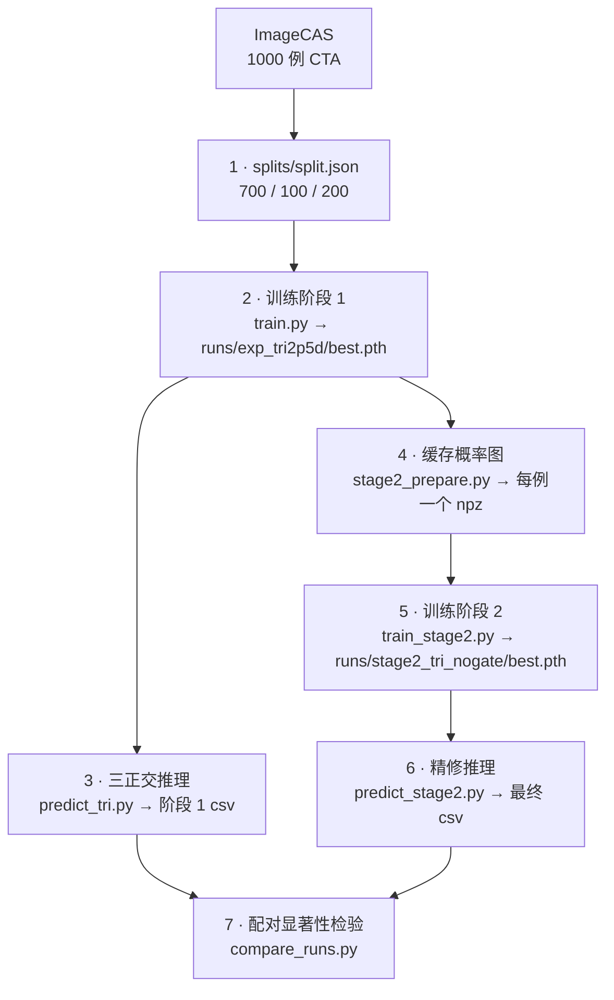

# CTA 冠状动脉分割

*[English version](README.md)*

基于 [ImageCAS](https://arxiv.org/abs/2211.01607) 数据集（1000 例，划分 700 / 100 / 200）
的两阶段冠脉树分割流水线。

冠脉管腔只占 CTA 体积的**不到 1%**，且是细长的分支树。丢掉一根远端分支，Dice 几乎不动，
但分割结果的临床价值恰恰就在这个连通性上。因此本项目**同时优化并报告拓扑指标与重叠指标**。

---

## 结果

以下均为**完整 200 例测试集**上的均值，后处理口径统一
（`--min-voxels 300 --max-gap 0`）。

| 配置 | Dice | clDice | Betti-0 误差 | HD95 (mm) |
|---|---|---|---|---|
| 单轴 2.5D | 0.7955 | 0.8581 | 4.19 | 24.98 |
| 单轴 2.5D + TTA | 0.8027 | 0.8670 | 3.68 | 23.66 |
| 三正交融合（阶段 1） | 0.8098 | 0.8762 | 2.46 | 20.53 |
| **+ 拓扑感知精修（最终）** | **0.8216** | **0.8960** | **1.53** | **19.90** |

两个阶段都在**四项指标上全部改善**。所有比较均**逐病例配对**，用 Wilcoxon 符号秩检验，
并对四个指标做 Holm–Bonferroni 校正：

- **三正交融合 vs 单轴 + TTA** —— 四项全部显著
  （Dice *p* = 4.2 × 10⁻⁸，Betti-0 *p* = 1.5 × 10⁻¹²）
- **最终方法 vs 阶段 1** —— 四项全部显著
  （clDice *p* = 5.1 × 10⁻²³，200 例中 165 例改善；HD95 *p* = 0.037）

相对增益最大的是 **Betti-0 误差，相对单轴基线下降 63%**（4.19 → 1.53）——
也就是说，输出更接近解剖上本该有的那两棵连通的血管树。

上表每个配置的**逐病例指标 csv 都已入库**（`runs/` 下），因此无需 GPU
即可重算全部统计量（见复现流程第 7 步）。

---

## 方法

**阶段 1 —— 2.5D 三正交分割。** 一个 2D 网络以**共享权重**处理三个正交方向的切片。
每个输入把相邻 `2k+1 = 5` 层堆成通道，网络只预测中心层；推理时对三个方向的概率体
做逐体素平均融合。这样能在显存预算内拿到很宽的面内视野：3D 网络即便在 80GB 显存上
也只能处理约 128³ 的 patch，而冠脉树跨度超过 200mm。

**阶段 2 —— 拓扑感知残差精修。** 一个 3D 网络接收原图与阶段 1 的概率，预测对阶段 1
logit 的**残差修正**；残差头权重零初始化，训练从恒等映射开始。损失在 DiceFocal 区域项
之上加了 **soft-clDice**（可微的中心线重叠项）。该模块**不依赖前面接的是什么架构** ——
它在两种不同的阶段 1 输出上都有效。

```
预处理    RAS 定向 → 0.5mm 各向同性 → HU 加窗 [-200, 800] → [0, 1]
阶段 1    三正交 2.5D 切片 → 2D SegResNet → DiceCE → bfloat16 AMP
融合      三方向逐体素平均 → 阈值 0.50
阶段 2    [原图, p_阶段1] → 3D SegResNet → 残差 → DiceFocal + 0.5·soft-clDice
后处理    去除小于 300 体素的连通分量
评估      Dice · clDice · Betti-0 误差 · HD95，逐病例配对检验
```

---

## 仓库结构

`scripts/` 与 `slurm/` 用**同一套五组分类**，所以一个结果、产出它的脚本、跑它的作业，
路径是对齐的。

```
coronary-seg/
├── src/                       # 可复用模块
│   ├── data.py                #   三正交 2.5D 流水线、切片索引、类别均衡采样
│   ├── model.py               #   阶段 1 网络（2D SegResNet / UNet）
│   ├── engine.py              #   训练/验证循环、bfloat16 AMP、非有限梯度保护
│   ├── ckpt_init.py           #   --resume 与 --init-from（刻意分开）
│   ├── stage2_{data,model,loss}.py
│   ├── spatial_prior.py       #   探索过，未采用
│   └── smart_reconnect.py     #   实验否决，默认关闭
├── scripts/                   # 入口脚本，按流水线阶段分组
│   ├── data/  train/  predict/  analysis/  figs/
├── slurm/                     # 可选的批处理作业封装，分组与 scripts/ 相同
├── runs/                      # 逐病例指标 csv，一个配置一个目录
├── splits/split.json          # 冻结的 700/100/200 划分，seed 42
├── tests/                     # 直接运行：python tests/xxx.py
└── configs/default.yaml
```

模型权重不入库，**但产出它们的逐病例 csv 入库** —— 上面每一条比较都是由
`scripts/analysis/compare_runs.py` 从这些 csv 重新算出来的。

---

## 复现流程

整条流水线共 7 步。第 2–6 步需要 CUDA GPU；第 7 步只读 csv，
不需要 GPU，也不需要装 PyTorch。



### 前置条件

| | |
|---|---|
| GPU | 一张 CUDA 显卡。所报模型用的是 80GB 显存，下面的 batch size 是照这个配的 —— 显存小就按比例调小 `--batch-size`。 |
| 磁盘 | 几百 GB。原始 ImageCAS 约 50GB；预处理缓存与阶段 2 张量各自更大（阶段 2 每例写 40–80MB，1000 例合计 40–80GB）。 |
| 时间 | 以天计，不是以小时计。阶段 1 要在约 1000 例上跑 70 个 epoch；三正交推理与阶段 2 数据准备都要对每个体积跑三遍网络。 |

所有耗时脚本都**支持断点续跑**：训练用 `--resume` 从 `last.pth` 恢复，
推理脚本会跳过输出 csv 里已有的病例，`stage2_prepare.py` 会跳过已存在的 `.npz`。

### 0 · 环境

Python 3.10+，PyTorch 用 CUDA 版本。先装 PyTorch（版本对齐你的 CUDA），再装其余依赖：

```bash
cd coronary-seg
python -m venv .venv && source .venv/bin/activate      # 或用 conda create / activate
pip install torch --index-url https://download.pytorch.org/whl/cu124
pip install -r requirements.txt
```

三个变量设一次，后面各步都会用到：

```bash
export PYTHONPATH=.                     # 必须：脚本以 `src.*` 方式导入
export CACHE=/path/to/cache/preproc  # 预处理后的体积缓存（首次运行时写入）
export S2DATA=/path/to/cache/stage2  # 阶段 2 张量
```

可选冒烟测试 —— 在 CPU 上过拟合单个 batch，几分钟就能看到 loss 塌下去。
在投入多天的正式训练之前值得先跑一遍：

```bash
CUDA_VISIBLE_DEVICES="" python scripts/train/train.py --cache-dir "$CACHE" \
    --overfit-one-batch --crop-size 128 --max-cases 5 --steps 150 --num-workers 0
```

### 1 · 数据与划分

本仓库**不转发数据集**。请自行从 Kaggle 下载 ImageCAS
（`xiaoweixumedicalai/imagecas`，约 50GB），并遵守数据集自身的许可条款。

本 README 里所有数字所依据的 700/100/200 冻结划分已入库在 `splits/split.json`。
它存的是绝对路径，改成指向你自己那份数据即可：

```bash
python - <<'PY'
import json, pathlib
ROOT = "/path/to/ImageCAS"          # 含 1-200/、201-400/ ... 的那一层目录
p = pathlib.Path("splits/split.json")
d = json.loads(p.read_text())
for records in d.values():
    if not isinstance(records, list):
        continue
    for r in records:
        for key in ("image", "label"):
            r[key] = f"{ROOT}/{'/'.join(r[key].split('/')[-2:])}"
p.write_text(json.dumps(d, indent=2))
PY

python scripts/data/check_data.py --data-root /path/to/ImageCAS   # 可选：完整性检查
```

`check_data.py` 会核对 1000 例数据是否齐全、`split.json` 里的病例是否都能在磁盘上找到，
并打印一个样本的 shape / spacing / 前景占比。第一次训练前跑一下 ——
这是发现 `ROOT` 写错的最省事的办法。

**沿用入库的这份划分**，数字才可比；重新生成一份就是另一个测试集，绝对值也会不同。

> `check_data.py --regenerate` 可以用同样的 seed 与比例从头生成划分，但它把图像路径
> 写在 `img` 键下，而训练流水线读的是 `image`。请按上面的方式**改路径**，不要重新生成。

### 2 · 训练阶段 1

三正交采样是默认行为，没有开关可以关掉。首次运行会建立预处理缓存与切片索引（慢），
之后的运行直接复用。

```bash
python scripts/train/train.py \
    --split-json splits/split.json --cache-dir "$CACHE" \
    --k 2 --crop-size 384 --batch-size 32 --epochs 70 --lr 3e-4 \
    --grad-clip 1.0 --backbone segresnet \
    --num-workers 8 --pin-memory \
    --out-dir runs/exp_tri2p5d
```

产出 `runs/exp_tri2p5d/best.pth`（验证 Dice 最优）与 `last.pth`（续跑用）。
**所报模型是 epoch 59、val Dice 0.8135** —— 这两个值都存在 checkpoint 里，
随时可以核对自己加载的是哪一份。

> `--batch-size 32 --crop-size 384` 才是产出所报模型的取值。
> `train.py` 里 argparse 的**默认值不是**这两个数，请以上面的命令为准。
>
> `--resume` 只用于**被中途打断**的训练。如果一次训练已经跑满 `--epochs`，
> 想在它之上再训一段，要用 `--init-from <ckpt> --out-dir <新目录>`：
> 用 `--resume` 会把已经退火完毕的余弦调度一起恢复，学习率会重新冲回峰值附近。
> 这一点由 `tests/test_init_from.py` 覆盖。

### 3 · 阶段 1 推理与评估

沿三个方向预测、取平均融合、二值化、去碎片，写出逐病例指标。

```bash
python scripts/predict/predict_tri.py \
    --cache-dir "$CACHE" --ckpt runs/exp_tri2p5d/best.pth \
    --fixed-fuse mean --thr 0.50 \
    --min-voxels 300 --max-gap 0 \
    --max-cases 0 --batch 1 --max-px-per-batch 500000 --pad-multiple 32 \
    --out-csv runs/exp_tri2p5d/test_metrics_tri_mean050_v2.csv
```

每一行同时包含该病例后处理前（`raw_*`）与后处理后（`pp_*`）的指标。
`--batch 1 --max-px-per-batch 500000` 是为了控显存 —— 矢状面/冠状面切片比轴位面大。
`--pad-multiple 32` 是 SegResNet 跳连的要求，评估前会还原。

> 该脚本会**跳过 `--out-csv` 里已有的病例**。改了任何配置都要换一个新文件名，
> 否则 200 例会被全部跳过，白跑一趟还以为是新结果。

### 4 · 缓存阶段 1 概率图

阶段 2 训练用的是落盘的张量，而不是实时跑阶段 1 推理。
这一步为每个病例写一个 `.npz`，内含 `{image, prob, label}`。

```bash
python scripts/data/stage2_prepare.py \
    --split-json splits/split.json --cache-dir "$CACHE" \
    --ckpt runs/exp_tri2p5d/best.pth --out-dir "$S2DATA" \
    --splits train,val,test \
    --tri --axes 0 1 2 --fuse mean \
    --k 2 --spacing 0.5 --hu-min -200 --hu-max 800 \
    --backbone segresnet --init-filters 32 --pad-multiple 32 \
    --batch 1 --max-px-per-batch 500000
```

`--splits` 用逗号分隔，可以分批跑（先 `--splits val,test`，再 `--splits train`）。
文件是原子写，已存在的会跳过，所以被打断后原样再执行一次即可从断点继续。

> 每个阶段 1 模型都要用**全新的 `--out-dir`**。指向一个由别的 checkpoint
> 填充过的目录，会得到混了两种来源的数据集 —— 「已存在就跳过」的逻辑分辨不出来。

### 5 · 训练阶段 2

最终配置是**不带残差门控**的（`--no-gate`），原因见[没走通的路](#没走通的路)。

```bash
python scripts/train/train_stage2.py \
    --data-dir "$S2DATA" \
    --no-gate \
    --batch-size 4 --epochs 30 --lr 3e-4 \
    --w-cldice 0.5 --cldice-warmup 500 --cldice-k 5 \
    --samples-per-case 16 --num-workers 8 \
    --out-dir runs/stage2_tri_nogate
```

产出 `runs/stage2_tri_nogate/best.pth`，**所报模型是 epoch 16、val Dice 0.8231**。
30 个 epoch 是刻意设的 —— 早期一次 80 epoch 的训练里 best 出现在 epoch 18，
之后全是过拟合。

两个消融各只差一个 flag，且**必须写到各自的输出目录**：

```bash
# 带残差门控（已否决）
python scripts/train/train_stage2.py --data-dir "$S2DATA" ... --out-dir runs/stage2_tri
# 去掉 soft-clDice（已否决）
python scripts/train/train_stage2.py --data-dir "$S2DATA" --no-gate --w-cldice 0 ... \
    --out-dir runs/stage2_tri_nocldice
```

> 这三次训练的 **loss 不能横向比较**：去掉 `--w-cldice` 只是从求和里少了一项，
> loss 会下降但模型并没有变好。**只能比 `val_dice`。**
> 门控只占 470 万参数里的 17 个，所以带/不带门控是一次干净的单变量消融。

### 6 · 最终推理与评估

```bash
python scripts/predict/predict_stage2.py \
    --data-root "$S2DATA/test" \
    --ckpt runs/stage2_tri_nogate/best.pth --no-gate \
    --init-filters 16 --thr 0.50 --min-voxels 300 --max-gap 0 \
    --roi 128 --overlap 0.5 --sw-batch 2 --max-cases 0 \
    --out-csv runs/stage2_tri_nogate/test_metrics.csv
```

> `--no-gate` 必须与训练时保持一致。checkpoint 是 strict 加载的，
> 不一致会直接报 key 不匹配，而不会悄悄评测成另一个模型。

每一行同时写入同一病例的阶段 1（`s1_*`）与阶段 2（`s2_*`）指标，
所以比较在结构上就不可能跨错病例集。

### 7 · 配对显著性检验

只读 csv —— 不需要 GPU，也不需要 PyTorch / MONAI：

```bash
python scripts/analysis/compare_runs.py \
    --baseline "阶段1=runs/exp_tri2p5d/test_metrics_tri_mean050_v2.csv:pp" \
    --runs     "最终=runs/stage2_tri_nogate/test_metrics.csv:s2" \
               "单轴=runs/exp_2p5d/test_metrics_optimal.csv:pp" \
               "单轴+TTA=runs/exp_2p5d/test_final_tta.csv:pp"
```

`:` 后面的后缀选的是 csv 里的列族 —— `predict.py` / `predict_tri.py` 用
`raw` / `pp`，`predict_stage2.py` 用 `s1` / `s2`。因为这些 csv 已经入库，
**这一步在你训练任何东西之前就能复现**本 README 顶部引用的全部 Wilcoxon 与 Holm 结果。

### 可选：参数扫描

以下每个脚本都只推理一次、缓存预测，之后扫整个参数网格不再消耗 GPU：

```bash
python scripts/analysis/sweep_threshold.py     --cache-dir "$CACHE" --ckpt <ckpt>  # 二值化阈值
python scripts/analysis/sweep_postproc.py      --cache-dir "$CACHE" --ckpt <ckpt>  # 最小分量、端点间隙
python scripts/analysis/sweep_spatial_prior.py --cache-dir "$CACHE" --ckpt <ckpt>  # 空间先验（默认关闭）
```

扫 HD95 或 Betti-0 时请用 `--case-ids` 而不是 `--max-cases N`：后者取的是**前** N 例，
而长尾病例并不在其中。

### 测试

不依赖 pytest，直接运行：

```bash
python tests/test_init_from.py                          # --resume 与 --init-from 的语义
python tests/test_multi_view.py                         # 阶段 2 多视角变体的跨文件接线
python src/model.py --k 2 --backbone segresnet          # 模块自测
python scripts/analysis/analyse_gate.py --self-test
```

---

## 没走通的路

阴性结果连同产生它们的实验一并保留在仓库里。**跑不起来的阴性结果不算结果。**

- **残差门控。** 本意是让修正只作用在阶段 1 出错的地方。消融显示它让**三项指标变差**。
  进到训练好的模型里直接测量给出了原因：门控**饱和**了（均值 0.86，范围 0.78–0.98），
  而且它施加在**本不该改动**的区域上的修正，是该改动区域的 **2.6 倍**。已从最终方案中移除。
- **方向间分歧。** 三个方向不一致的地方确实标记了错误，但两条利用路径都没走通：
  显式的自适应阈值规则在不同子集上**符号翻转**；把分歧作为额外输入通道交给网络学，
  则在三项指标上**显著更差**。
- **端点重连。** 连接断开的端点，连错的比连对的多 —— Betti-0 误差随允许间隙**单调上升**。
  代码在 `src/smart_reconnect.py`，默认关闭（`--max-gap 0`）。
- **空间先验**（删除远离血管树的假阳）在分层子集上有效，但参数**无法在子集间迁移**，
  因此代码保留（`src/spatial_prior.py`）、默认关闭（`--sp-dist 0`）。

---

## 实现要点

- **类别极不平衡。** 含血管的切片全部保留，背景切片按 0.25 的比例采样，配合 DiceCE 损失。
  简单地对正样本病例过采样被否决了 —— 那会让网络反复看同一小批病例，抬高过拟合风险。
- **用 bfloat16 而不是 float16。** 前景这么稀疏时 fp16 会溢出成 NaN；bf16 的动态范围与
  fp32 相同，且新一代数据中心 GPU 原生支持。此外每步更新前都检查梯度是否有限，
  非有限则跳过该步。
- **裁剪尺寸取 384 而不是 512。** 对 700 例训练集扫外接框，血管最大跨度为 291 体素，
  因此中心裁 384 零血管损失，同时比 512 省 44% 算力。
- **断点续训。** `last.pth` 用原子写（临时文件 + rename），训练在 epoch 中途被打断后
  `--resume` 可无缝继续。
- **`--resume` 与 `--init-from` 是两个独立的 flag。** 前者恢复模型、优化器、调度器、
  epoch 和最佳指标；后者只加载权重并重新开始调度。混用会在训练中途**静默重启学习率调度**。
  由 `tests/test_init_from.py` 覆盖。
- **推理可续跑。** 预测脚本读取已有 csv，跳过已评估的病例 ——
  这也正是换了配置就必须换输出路径的原因。

## 评估口径

四个指标，刻意选成互补而非冗余：**Dice**（体素重叠）、**clDice**（中心线一致性）、
**Betti-0 误差**（连通分量数之差）、**HD95**（边界距离的 95 分位，反映最坏情况）。

比较一律在完整 200 例测试集上**逐病例配对**，用 Wilcoxon 符号秩检验，
并对四个指标做 Holm–Bonferroni 校正。这一点很关键：**均值有差不等于有提升**，
而且在这份数据上，均值差与配对检验的结论**在两个方向上都出现过分歧**。

另有两条本项目用代价换来的规则，本仓库的结果都遵守：

- 对照组必须跑在**它自己的最优配置与最优权重**上。只把阶段 1 换成一个更好的
  checkpoint —— 同模型、同代码、同后处理 —— 就曾同时把两条结论**朝相反方向**推翻。
- 子集只能用来**排序**候选参数，**不能报绝对增益**。HD95、Betti-0 这类长尾指标由少数
  病例主导，在长尾富集的子集上，效应量会按富集倍数被放大。

## 局限

- 只用了一个数据集（ImageCAS），没有跨中心 / 跨设备验证。
- 阶段 2 在 128³ patch 上工作，看不到全局解剖。
- HD95 有重尾，主因是**假阳**（把主动脉、静脉等远离冠脉树的管状结构认成冠脉），
  而不是漏掉血管。

## 数据

**ImageCAS** —— 1000 例心脏 CTA 及冠脉标注。
Zeng 等，*Computerized Medical Imaging and Graphics*，2023
（[arXiv:2211.01607](https://arxiv.org/abs/2211.01607)）。

本仓库**不转发数据集**，请自行从 Kaggle（`xiaoweixumedicalai/imagecas`）获取，
并遵守数据集自身的许可条款。

## 许可

本仓库的**代码**以 [MIT License](LICENSE) 发布。
该许可只覆盖代码 —— ImageCAS 数据集有它自己的许可条款，不受此影响。

更详细的开发记录（含完整实验历史与每个决策的来龙去脉）见
[`coronary-seg/README.md`](coronary-seg/README.md)。
